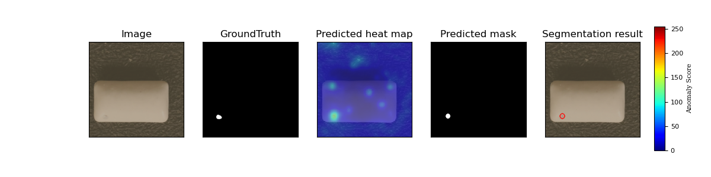

# VisA-PaDiM
授業で作成したPaDiMでVisAデータセットに対して異常検知を行なうプログラムのリポジトリです．

## データの説明
[Registry of Open Data on AWS](https://registry.opendata.aws)で公開されているVisual Anomaly (VisA)[[1]](#参考文献)というデータセットを使用した．  
VisAデータセットは産業界の品質検査のための視覚的な異常検知用データセットで，プリント回路基板 (PCB) などの3つの領域に対し，カプセルやキャンドル，マカロニ，チューインガムなどの12種類の物体を対象とした10,821枚の高解像度カラー画像から成っている．  
正常なサンプルは9,621枚，異常なサンプルは1,200枚あり，産業用異常検知データセットの中では規模の大きなデータセットである．


### データの詳細
今回はVisAデータセットの中でもチューインガム(Chewing Gum)のデータを使用する．  
チューインガムの画像は正常なサンプルが503枚，異常なサンプルが100枚から成っている．  
正常なサンプル503枚のうち，SageMakerの16GBという少ないメモリであっても計算ができ，かつ異常検知の性能を出せるように100枚を抽出し，機械学習の訓練用データとして使用する．  
この100枚は恣意的に選ぶことを避けるため，番号順に並べたときの前半100枚を使用する．  
異常なサンプルは100枚すべてをテスト用データとして使用する．  
異常なサンプルにはchunk of gum missing, scratches, small cracks, corner missing, similar colour spotの5種類の異常が存在する．

### データの配置
以下のように構造を変更しています．

* VisA
    * chewinggum
        * train
            * Normal
                * 000.JPG
                * 001.JPG
                * ...
        * test
            * Anomaly
        * Masks
            * Anomaly

## 手法
PaDiM[[2]](#参考文献)を使用した．PaDiMとはImageNet[[3]](#参考文献)で事前学習済みCNNモデルを利用した異常検知の手法である．  
参考：[https://github.com/xiahaifeng1995/PaDiM-Anomaly-Detection-Localization-master](https://github.com/xiahaifeng1995/PaDiM-Anomaly-Detection-Localization-master)

## 環境
[SageMaker](https://studiolab.sagemaker.aws/)をを使用しCPU環境で，訓練データでのPaDiMの共分散行列の計算およびテストデータに対する異常検出と性能評価を行なった．  
[environment.yml](./environment.yml)を実行することで，環境の構築ができ，[chewinggum.ipynb](./chewinggum.ipynb)の1行目にある以下を実行することで，pytorchをインストールすることができる．
```python
pip install torch==1.7.1+cu110 torchvision==0.8.2+cu110 torchaudio==0.7.2 -f https://download.pytorch.org/whl/torch_stable.html
```

## 結果
AUROC 0.983とかなり良い精度で検出できた．


### chunk of gum missing


### scratches


### small cracks


### similar colour spot


## 参考文献

1. Zou, Y., Jeong, J., Pemula, L., Zhang, D., & Dabeer, O. (2022, November). SPot-the-Difference Self-supervised Pre-training for Anomaly Detection and Segmentation. In Computer Vision–ECCV 2022: 17th European Conference, Tel Aviv, Israel, October 23–27, 2022, Proceedings, Part XXX (pp. 392-408). Cham: Springer Nature Switzerland.
2. Defard, T., Setkov, A., Loesch, A., & Audigier, R. (2021, March). Padim: a patch distribution modeling framework for anomaly detection and localization. In Pattern Recognition. ICPR International Workshops and Challenges: Virtual Event, January 10–15, 2021, Proceedings, Part IV (pp. 475-489). Cham: Springer International Publishing.
3. Deng, J., Dong, W., Socher, R., Li, L. J., Li, K., & Fei-Fei, L. (2009, June). Imagenet: A large-scale hierarchical image database. In 2009 IEEE conference on computer vision and pattern recognition (pp. 248-255). Ieee.